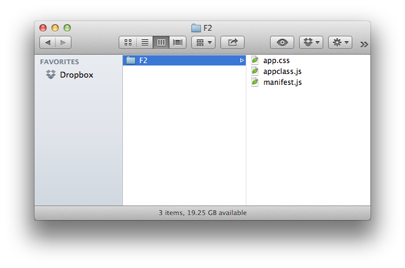

% App Development

<p class="lead">You've come to the right place if you want to start building F2 apps. Before continuing, make sure you've [cloned the F2 repository on GitHub](https://github.com/OpenF2/F2#quick-start) or [downloaded the latest framework build](index.html#get-started) (v{{sdk.version}}). Secondly, [read about the F2 Framework](index.html#framework). There are a few important concepts to help you better understand apps, containers and context.</p>

F2 apps are synonymous with modules, widgets and portlets. Think charts, portfolios, trade tickets, and screeners. F2 apps only need to be programmed once, no matter where they will be used. To start, F2 Apps are either:

<dl class="dl-horizontal">
	<dt>Display App</dt>
	<dd>A display app presents information to users in the form of a visible widget (using HTML, CSS, and JavaScript).</dd>
	<dt>Data App</dt>
	<dd>A data app is a content feed available in industry-standard formats including JSON, JSONP, RSS or app developer-designed XML.</dd>
</dl>

For the purposes of the documentation on this page, we'll focus on developing **display apps**. Browse to [The Basics: Framework](index.html#apps) for more background information about F2 apps.

_Interested in developing F2 containers? [Browse to Container Development](container-development.html)._

* * * *

## Get Started

To help you get started building an F2 app, browse through the resources below. To jump start your F2 app development, download the F2 app template (which now includes a basic container) _or_ follow the instructions below.

<p><a href="https://github.com/downloads/OpenF2/F2/Basic-F2-App-Template-1.0.4.zip" class="btn btn-primary">Download Basic F2 App Template</a></p>

### Basic Container

To begin, you **do not need to build F2** [as described in the readme on GitHub](https://github.com/OpenF2/F2#build-f2). Simply download [Bootstrap](http://twitter.github.com/bootstrap/index.html) and save a local copy of [F2.js](f2js-sdk.html). Also ensure you're [properly configured](#configuration).

<p><a href="https://raw.github.com/OpenF2/F2/master/f2.js" class="btn">Download F2.js</a> <a href="http://twitter.github.com/bootstrap/getting-started.html#download-bootstrap" class="btn">Download Bootstrap</a></p>

Create your basic container HTML template:

```html
<!DOCTYPE html>
<html>
    <head>
        <title>F2 Container</title>
        <link rel="stylesheet" href="/path/to/your/bootstrap.css">
    </head>
    <body>
        <div class="container">
            <div class="hero-unit">
                <h1>Hello F2</h1>
            </div>
            <div class="row"><!--apps go here--></div>
        </div>
        <!--include jQuery & Bootstrap-->
        <script src="http://code.jquery.com/jquery-latest.js"></script>
        <script src="/path/to/your/bootstrap.js"></script>
        <!--include F2.js-->
        <script src="/path/to/your/F2.js"></script>
        <!--init & register-->
        <script>
            (function(){
                //define AppConfigs
                var _appConfigs = [{
                    appId: "com_your_app_id",
                    description: "F2 app description",
                    name: "F2 App",
                    manifestUrl: "/path/to/your/manifest.js" //note the path to your manifest! 
                }];
                //Setup ContainerConfig
                F2.init({
                    beforeAppRender: function(app){
                        var appRoot = '<section class="well span12"></section>';
                        return $(appRoot).appendTo('div.row');
                    },
                    afterAppRender: function (app, html) {
                        //app.root is `appRoot` from beforeAppRender()
                        return $(app.root).append(html);
                    }
                }); 
                F2.registerApps(_appConfigs); //pass _appConfigs to initialize apps
            })();
        </script>
    </body>
</html>
```

In developing a more advanced container, the HTML document's `body` element would contain additional markup and allow for specific positioning or placement of apps. Additionally, more advanced containers could introduce features and functionality to their apps in the form of authentication APIs, streaming data feeds, federated search, etc. All containers must follow the [F2 design guidelines](container-development.html#container-design).

### Basic App

Create your basic [F2 app manifest](#app-manifest) and save it as `/path/to/your/manifest.js` using this code below. Note the path to this file should be specified in the `manifestUrl` property within the `_appConfigs` array in your basic container (shown above).

```javascript
F2_jsonpCallback_com_your_app_id({
    "scripts": [],   
    "styles": [],   
    "apps": [{
        "data": {},
        "html": "<div><p>Hello, world. I'm an F2 app.</p></div>"
    }]
})
```

<span class="label">Note</span> You can [download the F2 app template](https://github.com/downloads/OpenF2/F2/Basic-F2-App-Template-1.0.4.zip) instead of creating the basic app by hand.

### Testing the Basics

Now with a basic container and a basic app, you can load your F2 container and expect to see:


In getting to this point, you've only scratched the surface of F2 containers and apps. Continue reading and understanding the F2 spec to build exactly the financial solutions that our customers want.

### Sample Apps and Container

Good news! In the [project repo on GitHub](https://github.com/OpenF2/F2/tree/master/examples/container/), you will find a basic container along with a number of sample apps which demonstrate functionality far beyond the basic app above. Once you clone or download the project repository, open the sample container by pointing your browser at:

`http://localhost/F2/examples/container/`

### Configuration

It is assumed you will be developing F2 apps locally and have a `localhost` setup. The URLs mentioned in this specification also assume you have configured your F2 apps to run at `http://localhost/F2/`. The examples provided as part of the project repository demonstrate apps written in different languages (PHP, JavaScript, C#). While it is not a requirement you have a web server configured on your computer, it will certainly allow you to more deeply explore the sample apps.

To better understand F2 and the role of apps, you need to understand the role of the container. If you haven’t already, [read more about containers in the Framework](index.html#framework). 

To get started working with or developing containers, browse to the [documentation for developing the container](container-development.html).

**Ready to start coding?** 

<p><a href="#developing-f2-apps" class="btn btn-primary">Developing F2 Apps</a> <a href="./sdk/" class="btn">F2.js SDK Reference</a></p>

* * * *

## App Design

Design considerations are an important first step when creating a new app. Content can range from news to research to multimedia, and content should be presented using [Progressive Enhancement](http://www.alistapart.com/articles/understandingprogressiveenhancement/), [Mobile First](http://www.lukew.com/presos/preso.asp?26) and [Responsive Design](http://www.abookapart.com/products/responsive-web-design) methodologies. That is to say multimedia content, for example, should be shown plugin-free (using HTML5 video or audio elements) for capable browsers and fallback to Flash-based players for browsers that do not yet support HTML5 related technologies. ([VideoJS](http://videojs.com/) is good example of open-source JavaScript and CSS "that makes it easier to work with and build on HTML5 video, today.")

If App Developers embed URLs back to their own websites or to third party sites, URLs must be opened in a new window as to not interrupt the experience of someone using the container. If authentication is required on an App Developer's site, this can be accomplished with pass-through authentication using encrypted URLs as discussed in [Single Sign On](#single-sign-on).

### Choices

In order to ensure that apps built using F2 are successful, they must be accessible. As such, F2 made choices for which open-source libraries and frameworks would be leveraged to reduce the level of effort across F2 adopters. 

[Read more about those choices in the Framework](index.html#choices).

Ultimately, the responsibility of app design falls on either the Container or App Developer. In many cases, Container Developers will provide App Developers will visual designs, style guides or other assets required to ensure apps have the form and function for a given container. Container Developers may also [provide CSS for App Developers](index.html#creating-a-common-look-and-feel) to adhere to&mdash;which should be easy since F2 enforces a [consistent HTML structure across all containers and apps](app-development.html#automatic-consistency).

* * * *

## Developing F2 Apps

Let's take a close look at how to build an F2 app. We'll explain how to get an F2 AppID, what the `AppManifest` is all about, what output format your app needs to support, how the contents of the `AppContent.html` property work, and the two hooks for adding form and function to your app: `scripts` and `styles`.

Before opening your editor, [read the configuration assumptions](#configuration).

### F2 AppID

To develop an F2 app, you need a unique identifier called an **AppID**. This AppID will be unique to _your app_ across the entire open financial framework ecosystem. The format of the AppID looks like this: `com_companyName_appName`, where the `companyName` "namespace" is your company name and `appName` is the name of your app.

As an example, your AppID could look like this:

`com_acmecorp_watchlist`

If you built more than one app while working at Acme Corporation, you could create more AppIDs. All of these are valid:

* `com_acmecorp_watchlist2`
* `com_acmecorp_watchlist_big_and_tall`
* `com_acmecorp_static_charts`
* `com_acmecorp_interactive_charts`

To guarantee uniqueness, we have provided an AppID generation service that allows you to customize your AppID.

<a href="https://developer.openf2.com/GetAppID" class="btn btn-primary">Get Your F2 AppID Now &raquo;</a>

### Setting Up Your Project

Once you have your AppID, start by setting up your project. You will need at least one file: the **App Manifest**. Create a new file called `manifest.js`. Also, chances are you'll want custom styling and functionality, so go ahead and create `appclass.js` (for your app logic) and `app.css` for your CSS. Your project folder should look like this:



<span class="label">Helper</span> [Download the F2 app starter zip](https://github.com/downloads/OpenF2/F2/Basic-F2-App-Template-1.0.4.zip) or read about [setting up a basic container and app](#get-started) in Getting Started.

### App Manifest

For an app to be considered F2-capable, it must first have this basic structure&mdash;called the **App Manifest**&mdash;represented in [JSON](http://json.org):

```javascript
{
	"inlineScripts":[],	 
	"scripts":[],	 
	"styles":[],	 
	"apps":[{
			"data":{},
			"html":"",
			"status":""
	}]
}
```

The [App Manifest](./sdk/classes/F2.AppManifest.html) can be generated by the server-side code of your choice or be written-by-hand in your favorite text editor. In the [GitHub repository](https://www.github.com/OpenF2/F2), there are apps written in JavaScript, PHP, and C# to serve as examples to get you started.

When it's complete (using the examples further below), the App Manifest looks like this:

```javascript
F2_jsonpCallback_com_companyname_appname({
	"inlineScripts":["(function(){ var foo = bar; doSomething(); })()"],
	"scripts":[
		"http://www.domain.com/js/appclass.js"
	],	 
	"styles":[
		"http://www.domain.com/css/app.css"
	],	 
	"apps":[{
			"data":{ 
				foo: "bar",
				value: 12345
			},
			"html":"<div class=\"sunrise\">Hello world.</div>",
			"status":"good"
	}]
})
```

Let's break the App Manifest object down and look at each property (in reverse order to keep it fun).

### Apps

The `apps` property is an array of `AppContent` objects. Each `AppContent` object contains three properties: 

1. `html` 
2. `data`
3. `status`

#### html

The `html` property contains the view of your app represented in (optionally encoded) HTML. While you can modify the way your app appears or functions within the container, the `html` property is what the container will show when it [registers your app](container-development.html#app-integration) and displays its contents for the first time.

Example:

```javascript
"html": "<div class=\"sunrise\">Hello world.</div>"
```

The _optionally encoded_ version of the `html` example above is:

```javascript
"html": "%3Cdiv%20class%3D%22sunrise%22%3EHello%20world.%3C%2Fdiv%3E"
```

#### data

The `data` property exists to support the placement of arbitrary data needing to be passed along with the app. _This field is optional._

Example:

```javascript
"data": { 
	foo: "bar",
	value: 12345
}
```

#### status

The `status` property allows app developers to communicate a server-side arbitrary status code to itself or to the container. _This field is optional._

Example:

```javascript
"status": "good"
```

### Styles

The `styles` property is an array of URLs. The `styles` array refers to any CSS files needed by the app so it will be displayed properly on the container. The externally-referenced CSS files should be fully-qualified, including a protocol. 

Example:

```javascript
"styles": [
	"http://www.domain.com/css/app.css"
]
```

In the case when multiple stylesheetes are needed, simply add to the array as shown in this example:

```javascript
"styles": [
	"http://www.domain.com/css/app.css",
	"http://www.domain.com/css/app-responsive.css"
]
```

[Read more about CSS and namespacing](#namespacing) inside your app.

<span class="label label-info">Note</span> URLs referenced in the Scripts and Styles arrays are loaded synchronously by F2.js, so be sure to order your scripts properly. 

### Scripts

The `scripts` property is an array of URLs. The `scripts` array refers to any JavaScript files needed by the app so that it will function correctly on the container. The externally-referenced JS files should be fully-qualified.

Example:

```javascript
"scripts": [
	"http://www.domain.com/js/appclass.js"
]
```

In the case when multiple scripts are needed, simply add to the array as shown in this example:

```javascript
"scripts": [
	"http://www.domain.com/js/lib.js",
	"http://www.domain.com/js/appclass.js"
]
```

[Read more about JavaScript and namespacing](#namespacing) inside your app.

<span class="label label-info">Note</span> URLs referenced in the Scripts and Styles arrays are loaded _synchronously_ by F2.js, so be sure to order your scripts properly. 

### Inline Scripts

The `inlineScripts` property is an array of strings. The `inlineScripts` array can include any JavaScript code needed by the app that _cannot be included in your [App Class](#scripts)_. The contents of the `inlineScripts` array will be evaluated as JavaScript (using `eval()`) when all `scripts` have finished loading.

Example:

```javascript
"inlineScripts": [
	"(function(){ var foo = bar; doSomething(); })()"
]
```

<div class="well well-small">
<h4>About Inline Scripts</h4>
<p>While the use of `inlineScripts` is supported by F2's App Manifest, it is not recommended for use. There are many reasons for this, the main one is to avoid cluttering the global namespace. Developers should make every attempt to put their JavaScript code inside their [App Class](#scripts).</p>
</div>

[Read more about JavaScript and namespacing](#namespacing) inside your app.

<span class="label label-info">Note</span> URLs referenced in the Scripts and Styles arrays are loaded _synchronously_ by F2.js, so be sure to order your scripts properly. 

### Sample App Manifest

If we use the examples above, our `AppManifest` would look like this:

```javascript
F2_jsonpCallback_com_companyname_appname({
	"inlineScripts":["(function(){ var foo = bar; doSomething(); })()"],
	"scripts":[
		"http://www.domain.com/js/appclass.js"
	],	 
	"styles":[
		"http://www.domain.com/css/app.css"
	],	 
	"apps":[{
			"data":{ 
				foo: "bar",
				value: 12345
			},
			"html":"<div class=\"sunrise\">Hello world.</div>",
			"status":"good"
	}]
})
```

<span class="label">Note</span> You may have noticed the presence of the function name `F2_jsonpCallback_com_companyname_appname` on the first line of the example above. That function name is the callback and is explained in [App Manifest Response](#app-manifest-response).


### App Manifest Response

OK, so you know about F2 apps and you're ready to write your own App Manifest. To go from zero to _something_, [download the F2 app starter zip](https://github.com/downloads/OpenF2/F2/Basic-F2-App-Template-1.0.4.zip). Once you have your `AppManifest` defined (or at least stubbed out), there's one important detail you need to know now&mdash;the App Manifest response format. 

As part of F2, containers register apps&mdash;typically hosted on different domains&mdash;using JSONP. **This means F2 App Manifest files must provide a JSONP callback function.** (If you don't know what JSONP is or how it works, we recommend [reading what Remy Sharp has to say](http://remysharp.com/2007/10/08/what-is-jsonp/) about it.)

For security reasons, the App Manifest JSONP callback function must be a specific, reliable, and testable format. F2 has defined that using a combination of a string and your unique F2 AppID. The JSONP callback function name looks like this:

`F2_jsonpCallback_<AppID>`

When applied, the final (bare bones) App Manifest file looks like this example (where `com_companyname_appname` is your AppID):

```javascript
//manifest.js
F2_jsonpCallback_com_companyname_appname({
	"scripts":[
		"http://www.domain.com/js/appclass.js"
	],	 
	"styles":[
		"http://www.domain.com/css/app.css"
	],	 
	"apps":[{
			"html":"<div class=\"sunrise\">Hello world.</div>"
	}]
})
```

<span class="label">Note</span> the JSONP callback function name will _not_ be passed from the container using a traditional querystring parameter (HTTP GET), so you must configure this correctly for your app to appear on a container. This means you have to hard-code it in your `appmanifest.js`.

<span class="label label-important">Required</span> Don't forget you need an AppID before you can run your app on a container. [Get your AppID now &raquo;](https://developer.openf2.org/GetAppID)

### App HTML

Every F2 app has HTML. The only catch is that the HTML isn't provided by the app itself but rather _passed to the container_ via the app's `AppManifest`. But that's not a problem because F2 has [provided examples](https://github.com/OpenF2/F2/tree/master/examples/apps) to show you the way. Here are the steps for getting your app HTML into your `AppContent.html` property:

1. Develop the web page or module or widget or component or portlet that will be your app.
2. Take all the contents of it&mdash;that is, the HTML&mdash;and encode it. _(This step is optional.)_
3. Put the (optionally encoded) result in the `html` property of your `AppContent` object within your App Manifest file's `App` object.

**Huh?** Check out this example:

Step 1.

```html
<div class="sunrise">Hello world.</div>
```

Step 2. Encoded HTML. _(Optional)_

```html
%3Cdiv%20class%3D%22sunrise%22%3EHello%20world.%3C%2Fdiv%3E
```

Step 3. App Manifest file. 

```javascript
{
	...
	"apps":[{
		"html": "<div class=\"sunrise\">Hello world.</div>"
		...
	}]
}
```

<span class="label label-info">Note</span> You are not required to encode the app HTML, so follow steps 2 and 3 above omitting the encoding step.

#### Automatic Consistency

F2 uses and recommends [Twitter Bootstrap](http://twitter.github.com/bootstrap/) for Container and App Developers to benefit from a consistent HTML and CSS structure regardless of who developed the F2 component. This way, Container Developers can write CSS they _know_ will style F2 apps without engaging with the app developer to ensure compatability.

This also means App Developers must adhere to [Bootstrap's scaffolding guidelines](http://twitter.github.com/bootstrap/scaffolding.html) as defined on their website. 

An example two-column layout using Bootstrap-specifed markup:

```html
<div class="row">
  <div class="span4">...</div>
  <div class="span8">...</div>
</div>
```

The `.span4` and `.span8` provide two columns in the [12-column grid](http://twitter.github.com/bootstrap/scaffolding.html#gridSystem).

<span class="label">Note</span> Read more about [Creating a Common Look and Feel with F2](index.html#container).

### Scripts & Styles

Once your app is on the container, chances are you'll want it to actually do something. As an app developer, it is entirely up to you to write your own stylesheets and javascript code to add form and function to your app. F2's standardized App Manifest provides hooks for your CSS and scripts to get onto the container&mdash;just use the `scripts` and `styles` arrays detailed above in the [App Manifest](#app-manifest).

### Styles

Including your own CSS in the `styles` array of the App Manifest opens the door to the potential of unexpected display issues. Therefore, as an app developer, you are required to properly namespace your CSS selectors and declarations. For the details on writing correctly namespaced code, [read the namespacing docs](#namespacing).

It is recommended you include your app styles in a file named `app.css`.

### Scripts

#### App Class

While it isn't required, it's expected all F2 apps will ship with javascript. This code should be included in an `appclass.js` file as shown in [Setting Up Your Project](#setting-up-your-project). The `F2.Apps` property is a namespace for app developers to place the javascript class that is used to initialize their app. The javascript classes should be namepaced with the `F2.App.AppID`. It is recommended that the code be placed in a closure to help keep the global namespace clean.

For more information on `F2.Apps`, [browse over to the F2.js SDK docs](./sdk/classes/F2.App.html).

To make it even easier to build F2 apps and for faster app loading by the container, the F2.js SDK provides automatic JavaScript method execution at appropriate times during `F2.registerApps()` (and the internal `_loadApps()` method). If the class has an `init()` function, it will be called automatically during execution of F2's `registerApps()` method.

We recommend&mdash;and have samples below for&mdash;two different patterns for writing your `appclass.js` code: prototypal inheritence or the module pattern.

#### Arguments

When F2's `registerApps()` method is called by the container, F2 passes three arguments to your App Class: `appConfig`, `appContent` and `root`. The SDK documentation details the contents of each arg and these should be familiar because [appConfig](./sdk/classes/F2.App.html) contains your apps' meta, [appContent](./sdk/classes/F2.AppManifest.AppContent.html) contains your `html`, `data` and `status` properties, and [root](./sdk/classes/F2.AppConfig.html#properties-root) is the outermost DOM element in which your app exists on the container. The `root` argument provides your App Class code your apps' parent element for faster DOM traversal.

Example:

```javascript
//appclass.js snippet
...
	var App_Class = function(appConfig, appContent, root) {
...
```

#### Prototypal Inheritance Pattern

We won't even begin to talk about or describe this fantastic design pattern simply because Douglas Crockford [has already written](http://javascript.crockford.com/prototypal.html) [all about it](http://javascript.crockford.com/inheritance.html). 

An example of an App Class using prototypal inheritance inside a [closure](http://davidbcalhoun.com/2011/what-is-a-closure-in-javascript) is below. Note the inclusion of the `App_Class.prototype.init()` function&mdash;which will be called automatically during app load&mdash;and the [trailing parentheses](http://peter.michaux.ca/articles/an-important-pair-of-parens), `()`, which are responsible for automatic function execution. Thanks to the closure, the `App_Class` is returned _and_ assigned to `F2.Apps["com_companyname_appname"]`.

```javascript
F2.Apps["com_companyname_appname"] = (function() {
    var App_Class = function(appConfig, appContent, root) {
    	// constructor
    }

    App_Class.prototype.init = function() {
        // perform init actions
    }

    return App_Class;
})();
````

#### Module Pattern

As an alternative to the prototypal inheritance pattern above, `appclass.js` code could be written following the module pattern shown in the example below. Note the inclusion of an `init()` function&mdash;which will be called automatically during app load&mdash;and the _exclusion_ of the closure and trailing parentheses present in the example using prototypal inheritance above.

```javascript
F2.Apps["com_companyname_appname"] = function(appConfig, appContent, root) {
   return {
       init:function() {
           // perform init actions
       }
   };
};
```

#### Patterns, Eh

Of course, you don't have to use either one of these patterns in your `appclass.js` file. What you _do_ have to use is a `function`. That is to say the value assigned to `F2.Apps["com_companyname_appname"]` by your App Class code _must be a function_. Within F2's `registerApps()` method, the `new` operator is used which produces an object ([check out the code](https://github.com/OpenF2/F2/blob/master/sdk/f2.debug.js#L2893)).

<div class="alert">
	<h5>Important!</h5>
	<p>In the absence of a function in your `appclass.js`, F2 will be unable to load your app on a container.</p>
</div>

If you don't want to think about any of this and would rather just start coding, [download the F2 app starter zip](https://github.com/downloads/OpenF2/F2/Basic-F2-App-Template-1.0.4.zip).

* * * *

## Namespacing

F2 is a _web_ integration framework which means apps are inherently insecure&mdash;at least those _non-secure_ apps. Following this spec, App Developers must avoid CSS collisions and JavaScript namespace issues to provide users with the best possible experience.

<span class="label">Note</span> Continue reading for [more specifics about secure apps](#secure-apps).

### Namespacing CSS

As discussed in [Developing F2 Apps: F2 AppID](#f2-appid), to develop an F2 app, you need a unique identifier called an AppID. This AppID will be unique to your app across the entire open financial framework ecosystem. The format of the AppID looks like this: `com_companyName_appName`, where the `companyName` "namespace" is your company name and `appName` is the name of your app.

When Container Developers [register apps](container-development.html#app-integration), F2.js draws each app as defined by the [ContainerConfig](container-development.html#container-config). Before the app is added to the container DOM, F2 automatically wraps an outer HTML element&mdash;with the AppID used as a class&mdash;around the rendered app.

This example shows app HTML after it has been drawn on the container. Note the `com_companyName_appName` classname.

```html
<div class="f2-app-container com_companyName_appName">
	...
</div>
```

To avoid styling conflicts or other display issues related to app-provided style sheets, **App Developers must namespace their CSS selectors.** Fortunately, this is quite easy. 

Every selector in app-provided style sheets must look like this:

```css
.com_companyName_appName p {
	padding:5px;
}

.com_companyName_appName .alert {
	color:red;
}
```

Note `.com_companyName_appName` is prefixed on both `p` and `.alert` selectors.

While the [CSS cascade](http://www.webdesignfromscratch.com/html-css/css-inheritance-cascade/) will assign more points to IDs and while prefixing F2 AppIDs on CSS selectors isn't required, it is recommended.

```css
.com_companyName_appName #notice {
	background-color:yellow;
}
```

<span class="label">Note</span> App Developers should familiarize themselves with [CSS namespacing rules for Container Developers](container-development.html#namespacing). They are largely the same with a couple notable additions.

#### About CSS Resets

It is a common web development practice to use [CSS resets](http://meyerweb.com/eric/tools/css/reset/), and it is likely both Container and App Developers will use them. Since there are many ways to normalize built-in browser stylesheets, including [Normalize.css](http://necolas.github.com/normalize.css/) which is used by Bootstrap, Container and App Developers must namespace their CSS reset selectors.

### Keeping JavaScript Clean

Adhering to one of the [OpenAjax Alliance](http://www.openajax.org/) goals, F2 also promotes the concept of an uncluttered global javascript namespace. For Container and App Developers alike, this means following this spec closely and ensuring javascript code is contained inside [closures](http://jibbering.com/faq/notes/closures/) or is extended as a new namespace on `F2`.

To ensure javascript bundled with F2 apps executes in a javascript closure, [follow the guidelines](#scripts-1) for the `appclass.js` file and one of the two patterns described (prototypal inheritance or module).

The [F2.js SDK](f2js-sdk.html) was designed with extensibility in mind and therefore custom logic can be added on the `F2` namespace.

Example:

```javascript
F2.extend('YourPluginName', (function(){
    return {
        doSomething: function(){
            F2.log("Something has been done.");
        }
    };
})());
```

For more information, read [Extending F2](extending-f2.html).

* * * *

## Context

### What is Context? 

Apps are capable of sharing "context" with the container and other nearby apps. All apps have context which means the app "knows" who is using it and the content it contains. It is aware of an individual's data entitlements and user information that the container is requested to share (name, email, company, etc).  

This means if a user wants to create a ticker-focused container so they can keep a close eye on shares of Proctor & Gamble, the container can send "symbol context" to any listening apps that are smart enough to refresh when ticker symbol PG is entered in the container's search box.

While apps can have context themselves, the responsibility for managing context switching or context passing falls on the container. The container assumes the role of a traffic cop—managing which data goes where. By using JavaScript events, the container can listen for events sent by apps and likewise apps can listen for events sent by the container. To provide a layer of security, this means apps cannot communicate directly with other apps on their own; apps must communicate via an F2 container to other apps since the container controls the [F2.Events API](./sdk/classes/F2.Events.html).

[Read more in the Framework](index.html#framework).

Let's look at some code.

### Container-to-App Context

In this example, the container broadcasts, or emits, a javascript event defined in `F2.Events.Constants`. The `F2.Events.emit()` method accepts two arguments: the event name and an optional data object.

```javascript
F2.Events.emit(
	F2.Constants.Events.CONTAINER_SYMBOL_CHANGE, 
	{ 
		symbol: "AAPL", 
		name: "Apple, Inc." 
	}
);
```

To listen to the `F2.Constants.Events.CONTAINER_SYMBOL_CHANGE` event inside your F2 app, you can use this code to trigger an alert dialog with the symbol:

```javascript
F2.Events.on(
	F2.Constants.Events.CONTAINER_SYMBOL_CHANGE, 
	function(data){
		F2.log("The symbol was changed to " + data.symbol);
	}
);
```

The `F2.Events.on()` method accepts the event name and listener function as arguments. [Read the SDK](./sdk/classes/F2.Events.html) for more information.

<span class="label">Note</span> For a full list of support event types, browse to the SDK for [F2.Constants.Events](./sdk/classes/F2.Constants.Events.html).

### Container-to-App Context (Server)

Often times containers will want to send context to apps during [app registration](./sdk/classes/F2.html#methods-registerApps). This is possible through the `AppConfig.context` property. This [property](./sdk/classes/F2.AppConfig.html#properties-context) can contain any javascript object&mdash;a string, a number, an array or an object. 

```javascript
//define app config
var _appConfigs = [
    {
        appId: "com_acmecorp_news",
        description: "Acme Corp News",
        manifestUrl: "http://www.acme.com/apps/news-manifest.js",
        name: "Acme News App",
        context: {
            sessionId: myApp.sessionId,
            someArray: [value1,value2]
        }
    }
];
```

When `F2.registerApps()` is called, the `appConfig` is serialized and posted to the app's manifest URL. The serialized object converts to [stringified JSON](./sdk/classes/F2.html#methods-stringify):

```javascript
{"appId":"com_acmecorp_news","description":"Acme Corp News","manifestUrl":"http://www.acme.com/apps/news-manifest.js","name":"Acme News App","context":{"sessionId":"12345", "someArray":["value1","value2"]}}
```

The `appConfig` object is sent to the server using the `params` querystring name as shown in the example below. This is the complete app manifest request sent by `F2.registerApps()` with the `appConfig` URL-encoded, of course:

```html
http://www.acme.com/apps/news-manifest.js?params=%7B%22appId%22%3A%22com_acmecorp_news%22%2C%22description%22%3A%22Acme%20Corp%20News%22%2C%22manifestUrl%22%3A%22http%3A%2F%2Fwww.acme.com%2Fapps%2Fnews-manifest.js%22%2C%22name%22%3A%22Acme%20News%20App%22%2C%22context%22%3A%7B%22sessionId%22%3A%2212345%22%2C%20%22someArray%22%3A%5B%22value1%22%2C%22value2%22%5D%7D%7D
```

This demonstrates complete flexibility of passing arbitrary context values from the container to any F2 app.

<span class="label label-important">Important</span> To receive context from a container during app initialization, F2 App Developers are required to build object deserialization for the `params` value into their app code.

### App-to-Container Context

In this example, your app emits an event indicating a user is looking at a different stock ticker _within your app_. Using `F2.Events.emit()` in your code, your app broadcasts the new symbol. As with container-to-app context passing, the `F2.Events.emit()` method accepts two arguments: the event name and an optional data object.

```javascript
F2.Events.emit(
	F2.Constants.Events.APP_SYMBOL_CHANGE, 
	{ 
		symbol: "MSFT", 
		name: "Microsoft, Inc." 
	}
);
```

The container would need to listen to your apps' broadcasted `F2.Constants.Events.APP_SYMBOL_CHANGE` event using code like this:

```javascript
F2.Events.on(
	F2.Constants.Events.APP_SYMBOL_CHANGE, 
	function(data){
		F2.log("The symbol was changed to " + data.symbol);
	}
);
```

<span class="label">Note</span> For a full list of support event types, browse to the SDK for [F2.Constants.Events](./sdk/classes/F2.Constants.Events.html).

### App-to-App Context

Apps can also pass context between apps. If there are two or more apps on a container with similar context and the ability to receive messages (yes, through event listeners, context receiving is opt-in), apps can communicate with each other. To communicate with another app, each app will have to know the event name along with the type of data being passed. Let's take a look.

Within "App 1", context is _sent_ using `F2.Events.emit()`:

```javascript
F2.Events.emit(
	"buy_stock", //custom event name
	{ 
		symbol: "GOOG", 
		name: "Google Inc",
		price: 682.68,
		isAvailableToPurchase: true,
		orderType: "Market Order"
	}
);
```

Within "App 2", context is _received_ using `F2.Events.on()`:

```javascript
F2.Events.on(
	"buy_stock", 
	function(data){
		if (data.isAvailableToPurchase){
			F2.log("Trade ticket order for " + data.symbol + " at $" + data.price);
		} else {
			F2.log("This stock is not available for purchase.")
		}
	}
);
```

### More Complex Context 

The examples above demonstrate _simple_ Context objects. In the event more complex data and/or data types are needed, F2 Context can support any JavaScript object&mdash;a string, a number, a function, an array or an object. 

This is an example Context object demonstrating arbitrary JavaScript objects:

```javascript
F2.Events.emit(
	"example_event", //custom event name
	{ 
		//number
		price: 100,
		//string
		name: 'John Smith',
		//function
		callback: function(){
			F2.log('Callback!');
		},
		//array
		watchlist: ['AAPL','MSFT','GE'],
		//object
		userInfo: {
			name: 'John Smith',
			title: 'Managing Director',
			groups: ['Alpha','Beta'],
			sessionId: 1234567890
		}
	}
);
```

If two apps want to communicate data for populating a trade ticket _and_ execute a `callback`, [appclass.js](#scripts-1) code might look like this:

```javascript
F2.Events.emit(
	"buy_stock", //custom event name
	{ 
		symbol: "GOOG", 
		name: "Google Inc",
		price: 682.68,
		isAvailableToPurchase: true,
		orderType: "Market Order",
		//define callback
		callback: function(data){
			alert('Trade ticket populated');
		}
	}
);
```

The F2 app listening for the `buy_stock` event would fire the `callback` function.

```javascript
F2.Events.on(
	"buy_stock", 
	function(data){
		F2.log("Trade ticket order for " + data.symbol + " at $" + data.price);
		//..populate the trade ticket...
		//fire the callback
		if (typeof data.callback === 'function'){
			data.callback();
		}
	}
);
```

### Types of Context

Context is a term used to describe the state of an F2 container and its apps. At the same time, Context is also the information passed from [Container-to-App](#container-to-app-context) or from [App-to-App](#app-to-app-context) or from [App-to-Container](#app-to-container-context). In the examples shown above, two types of context were shown: symbol and trade ticket context. It is important to realize F2.js allows client-side messaging between third parties using a collection of arbitrary name-value pairs. This provides the utmost flexibility and affords Container Developers the option to define context within their container.

#### Universal F2 Instrument ID

Said another way, while `{ symbol:"AAPL", name: "Apple, Inc" }` can be used to communicate symbol context, developers could also use `{ symbol: "123456789" }` to identify Apple, Inc. The latter is more likely given not all apps would programmatically understand `AAPL` but&mdash;given symbol lookup services&mdash;would understand `123456789` as the universal _F2_ identifier for Apple, Inc. It is clear Container and App Developers alike would prefer to communicate with a guaranteed-to-never-change universal ID for all instrument types across all asset classes.

F2 will be providing lookup web services in future releases that provide universal F2 identifiers for container and app providers. These lookup services will not just be limited to symbols.  _Further details will be forthcoming as the F2 specification evolves._

* * * *

## Secure Apps

F2 fully supports secure apps. A secure app is one that exists inside an `iframe` on a container _and_ is hosted on a different domain. The F2.js SDK provides developers with seamless handling of Context, UI and the other F2 APIs whether or not an app is secure. This means app developers do not have to code apps any differently if an app is secure.

An app is defined as "secure" in the [AppConfig](./sdk/classes/F2.AppConfig.html#properties-isSecure). Creating the `AppConfig` is something that is done when apps are registered on the [Developer Center](index.html#developer-center).

Noting the `isSecure` property, the `AppConfig` looks like this:

```javascript
{
	"appId": "com_f2_demo",
	"description": "A demo F2 app.",
	"height":250,
	"minGridSize": 4,
	"manifestUrl": "manifest.js",
	"name": "F2 App",
	"isSecure": true //secure boolean
}
```

To see examples of secure apps, [fork F2 on GitHub](https://github.com/OpenF2/F2) and point your browser at:

`http://localhost/F2/examples/container/`

The example container runs sample apps&mdash;defined in `sampleApps.js`&mdash;and that's where you'll find the `isSecure` flag defined in some of the `AppConfig` objects.

* * * *

## Container Integration

Good news! The container is responsible for loading its apps, and as long as you've followed F2's standard for [App Manifests](#app-manifest) and have a working&mdash;and tested&mdash;app, you're pretty much done.

If you're curious about _how_ containers load apps, browse to the [F2.js SDK `registerApps()` method](./sdk/classes/F2.html#method_registerApps) or [read Container Development](container-development.html#app-integration).

#### Testing Your App

When you [cloned the F2 GitHub repo](https://github.com/OpenF2/F2/#quick-start) you also got an example F2 container for your app development and testing. Open the project repository and navigate to `~/F2/examples/container` to find them or to jump-start your testing, point your browser at:

`http://localhost/F2/examples/container/`

If you open `~/F2/examples/container/js/sampleApps.js` in your text editor, you'll find a list of sample F2 apps broken down by programming language. Simply modify this file to your liking and add your app anywhere in the appropriate array (JavaScript, PHP or C#). The configuration is comprised of `F2.AppConfig` properties, and the following are the minimum **required** properties.

```javascript
{
	appId: "com_companyName_appName",
	manifestUrl: "http://www.domain.com/manifest.js",
	name: "App name"
}
```

For full details on these `F2.AppConfig` properties and all the others, [browse the F2.js SDK documentation](./sdk/classes/F2.AppConfig.html).

* * * *

## F2 UI

There are some utility methods provided within F2.js in the `UI` namespace. These helpers are for controlling layout, showing (or hiding) loading spinners, modals, managing views within your app, and more.

### Basics

While there are [numerous utility methods in F2.UI](./sdk/classes/F2.UI.html), we will focus on a couple important ones here such as `updateHeight()` and `showMask()`. The `F2.UI` methods are passed as an instance to each F2 apps' App Class on the `appConfig` argument. The instance of `F2.UI` gets added to the `appConfig` object at runtime, and is available in `appclass.js` as `appConfig.ui`.

Example:

```javascript
//appclass.js snippet
var App_Class = function (appConfig, appContent, root) {
	this.appConfig = appConfig;
	this.appContent = appContent;
	this.ui = appConfig.ui;	//F2.UI instance
	this.$root = $(root);
}
```

#### Adding or Removing DOM Elements in Your App

As the layout inside your app changes, your app should update or refresh its height on the container. This is particularly important for those secure apps inside iframes. To handle this, F2.js provides a `updateHeight()` method you should call **anytime a DOM element is added or removed from within an app**.

Assuming the example above is used, the `this.ui` property holds the instance of `appConfig.ui`.

```javascript
//appclass.js snippet
...
	//user deletes row
	$(".row").remove();

	//call updateHeight method
	this.ui.updateHeight();
...
```

#### Showing or Hiding Loading Spinners

Apps can show loading spinners&mdash;or "masks"&mdash;when they are being loaded by a container or afterwards when making data requests. Container Developers configure the `UI.Mask` as discussed in the SDK [F2.ContainerConfig.UI.Mask](./sdk/classes/F2.ContainerConfig.UI.Mask.html) docs, therefore it is simple for app developers to call `showMask()`. 

To show a loading spinner when making an ajax request within an app:

```javascript
//appclass.js snippet
...
	//show loading
	this.ui.showMask(this.root,true);

	//app makes data request
	$.ajax({
		url: "../data.json"
	}).done(function(jqxhr){
		F2.log(jqxhr);
		//hide loading
		this.ui.hideMask(this.root);
	});
...
```

The `showMask()` method takes two arguments: a DOM element where to show the mask and a boolean indicating whether or not to show a spinning graphic.

If you do not want to show a spinning graphic, simply pass `false` to the `showMask()` method. A mask without a spinner is useful in the case when you want to "lock" the view from user interaction.

```javascript
//appclass.js snippet
...
	//show mask, no spinner
	this.ui.showMask(this.root,false);
...
```

For full details, read about [F2.UI in the SDK](./sdk/classes/F2.UI.html). 

#### Changing the App Title

To update the title of an app in the app's chrome ([as defined by the container in F2.ContainerConfig.appRender](container-development.html#container-config)), very simply pass a string to the `setTitle()` method.

```javascript
//appclass.js snippet
...
	this.ui.setTitle("Chart for MSFT");
...
```

### F2.UI.Modals

F2.js provides two methods in `F2.UI` for modal dialogs. F2 uses and recommends [Twitter Bootstrap](http://twitter.github.com/bootstrap/) for many reasons, and taking advantage of [Bootstrap's modals](http://twitter.github.com/bootstrap/javascript.html#modals) was an easy choice. 

For full details on F2.UI.Modals and the two types of modals (`alert` and `confirm`), [read the SDK docs](./sdk/classes/F2.UI.Modals.html). 

Usage is simple:

```javascript
//appclass.js snippet
...
	this.ui.Modals.alert("A message to display in a modal.");
...
```

You can optionally provide a callback to be fired when the user closes the modal.

```javascript
//appclass.js snippet
...
	this.ui.Modals.alert("A message to display in a modal.", function(){
		F2.log("Modal closed!");
	});
...
```

Additionally, there is a `confirm` modal.

```javascript
//appclass.js snippet
...
	this.ui.Modals.confirm(
		"A message to display in a confirmation modal.", 
		function(){
			F2.log("OK clicked");
		},
		function(){
			F2.log("Cancel clicked");
		}
	);
...
```

### F2.UI.Views

Adding and managing views within an F2 app is considered an **advanced topic**. If your app only needs a single view, you don't have to worry about reading this part of the F2 spec.

F2 apps can have one or more views. Every app will have at least one "home" view, while others will include views for settings, help or about. Inside the F2.js SDK, we've [included support for views](./sdk/classes/F2.App.html#property_views) and the list can be extended by the container provider. 

<span class="label">Note</span> If the container doesn't support all the views you need inside your app, you will need to coordinate those additions with the container provider.

#### Setting Up Views

Once you've determined the views you'd like to include in your app, the view should be specified by applying the `F2.Constants.Css.APPVIEW` classname to the containing DOM Element. A `data-` attribute should be added to the element as well which defines what view type is represented. Twitter Bootstrap's `hide` class should be applied to views that are hidden on startup.

To setup a single view in your app, use this HTML on your app's outermost element noting the use of the `f2-app-view` classname and the `data-f2-view` attribute.

```html
<div class='f2-app-view' data-f2-view='home'>
	...
</div>
```

To setup multiple views in your app, write HTML like this noting the use the `f2-app-view` and `hide` classnames as well as the `data-f2-view` attributes.

```html
<div class='f2-app-view' data-f2-view='home'>
	...
</div>
<div class='f2-app-view hide' data-f2-view='about'>
	...
</div>
```

For details on `F2.Constants.Css.APPVIEW`, [browse to the SDK docs](./sdk/classes/F2.Constants.Css.html#properties-APP_VIEW).

#### Controlling View State

The `F2.UI` namespace provides an API for developers to manage F2 app View state. 

To programmatically change a View in javascript:

```javascript
appConfig.ui.Views.change(F2.Constants.Views.HOME);
```

<span class="label label-info">Note</span> When `appConfig.ui.Views.change()` is called, the `hide` classname is automatically added or removed by F2.js depending on the visibility of the view. [Read more in the SDK docs](./sdk/classes/F2.UI.Views.html#methods-change).

In F2 app HTML, you can use a combination of CSS classnames and `data-` attributes to provide UI elements making it easy for users to navigate between Views. 

For example, an app has two views: "home" and "about". On the "home" View, a button allows the user to navigate to the "about" view. In the presence of the classname `f2-app-view-trigger` and the `data-f2-view` data attribute, F2.js automatically adds a javascript event to the button.

```html
<div class="f2-app-view" data-f2-view="home">
	<!--use 'data-f2-view' to switch to the "about" View-->
	<button class="btn f2-app-view-trigger" data-f2-view="about">Show About View</button>
</div>
```

To get back to the "home" View from the "about" View:

```html
<div class="f2-app-view" data-f2-view="about">
	...
	<button class="btn f2-app-view-trigger" data-f2-view="home">&laquo; Back Home</button>
	...
</div>
```

#### Listening to App View Changes

You shouldn't be surprised to know F2.js contains event triggers for handling app View changes. To listen for View changes inside F2 app javascript code:

```javascript
appConfig.ui.Views.change(function(view){
	F2.log("View changed to ", view);
});
```

For details on `F2.UI.Views`, [browse to the SDK docs](./sdk/classes/F2.UI.Views.html) and for details on `F2.Constants.Views`, [head over to the F2.Constants docs](./sdk/classes/F2.Constants.Views.html).

* * * *

## Entitlements

User or content entitlements are the responsibility of the App Developer. Many apps will need to be decoupled from the content that they need. This could include apps like research aggregation, news filtering, streaming market data, etc. Similarly to how companies build their own websites today with their own authentication and access (or content) entitlements, F2 apps are no different.

_Further details around app entitlements will be forthcoming as the F2 specification evolves._

* * * *

## Single Sign-On

Single sign-on (SSO) is a shared responsibility between the Container and App Developer. In some cases, containers will want all of its apps to be authenticated seamlessly for users;that will be negotiated between Container and App Developers. For the purposes of this documentation, it is assumed Container Developers will build and host their container access authentication. 

Once a user is authenticated on the container, how is the user then authenticated with all of the apps? [Encrypted URLs](#using-encrypted-urls).*

<span class="label">Note</span> The Container Developer is free to utilize any app authentication method they deem fit. Container Developers and app developers will need to work together to finalize the authentication details.

### Using Encrypted URLs

Implementing SSO using encrypted URLs is a simple and straight-forward authentication mechanism for securing cross-domain multi-provider apps. To guarantee security between the Container and App Developer, secure API contracts must be negotiated. This includes, but is not limited to, the choice of cryptographic algorithm (such as `AES`) and the exchange of public keys.

When the container provider calls `F2.registerApps()`, custom logic should be added to append encrypted user credentials&mdash;on a need-to-know basis&mdash;to _each app_ requiring authentication.

[Read more in Developing F2 Containers](container-development.html).

### Considerations

Authentication is a critical part of any container-app relationship. There are a plethora of SSO implementations and there are many considerations for both Container and App Developers alike.

_Further details around container and app single sign-on will be forthcoming as the F2 specification evolves._

* * * *
