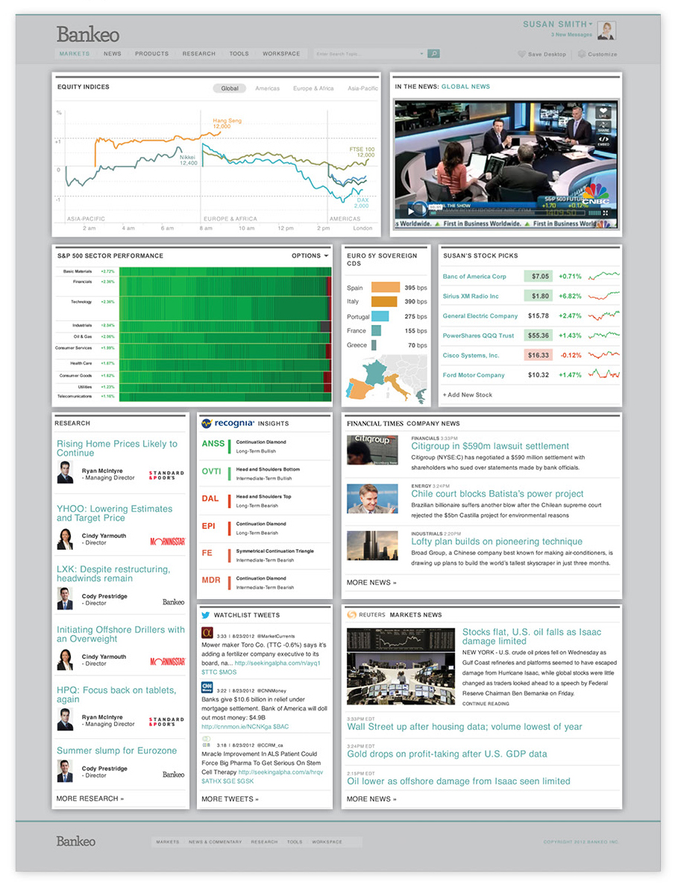
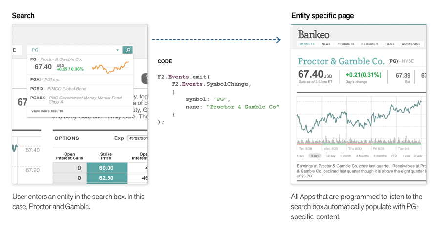

% About F2
% Mark Healey; Brian Baker; Kate Dinar

F2 is an open and free web integration framework designed to help you and other financial industry participants develop custom solutions that combine the best tools and content from multiple providers into one, privately-labeled, seamlessly integrated front-end. 

The [essential components](#framework) defined by the F2 specification are the container, apps, context and store&mdash;all supported under the hood by **F2.js**, a JavaScript SDK which provides an extensible foundation powering all F2-based web applications.

You can use the F2 framework to build:

* Customized solutions that include only the content, tools, and providers that you want,
* Private-labeled solutions that are true to your design standards and branding elements,
* User-customized experiences that remember each user's entitlements and preferences,
* Reusable apps that you can develop once and use cross-platform on web, tablet and mobile devices,
* A multi-vendor environment that enables each vendor to use a shared authentication scheme and to communicate context to each other so that they can act together as one.

* * * *

## Who

The F2 concept was born in Boulder, Colorado at [Markit On Demand](http://www.markitondemand.com) (MOD). F2 was brought to life through conversations with industry partners who individually express common frustrations and desire a coordinated solution.

MOD's development team is committed to following the technical guidelines defined by the F2 standard and actively contribute enhancements to future F2 releases.

### Advisory Board 

The F2 Advisory Board is an independent forum comprised of supportive industry participants. The Board’s purpose is to ensure that the F2 specification evolves to meet the needs of the industry.  Advice, guidance and thought-leadership from the collective community are integral to the success of F2. 

For more information about the F2 Advisory Board please contact [info@openf2.org](mailto:info@openf2.org).

* * * *

## Why

F2's goal is to create a development standard for the financial services industry that offers a cost saving, risk-reducing method for building innovative, multi-provider solutions. In order to do this effectively, F2 provides solutions that address shared industry hurdles and concerns.

Because the spec is open, free, and exactly what the industry needs, we believe that it will be widely adopted, which will create new markets for app developers, content providers, and create vibrant app ecosystems for participants.

<table class="table table-bordered">
	<thead>
		<tr>
			<th>Industry Problem</th>
			<th>F2 Solution</th>
		</tr>
	</thead>
	<tbody>
		<tr>
			<td>*Monolithic Systems* Monolithic, installed code bases that are closed and expensive to enhance.  When a "redesign" occurs on this type of platform, it's usually a do-over, from the ground-up. Integration is difficult.</td>
			<td> Nimble, modern use of internet-delivery with a multi-vendor approach.  Standardized framework used by all parties.  Cost-effective and shorter development cycles.</td>
		</tr>
		<tr>
			<td>*Big Bang* Big Bang approaches stifle innovation and require significant investment in the integration of legacy systems.  Buy-in from many stakeholders is essential and difficult to manage.  Entire platforms must be redeveloped in order to make cut-overs.  There are more bugs and problems at launch and unhappy  users. </td>
			<td> In the F2 environment  you will be able to compete on features. It is easy to progressively make changes, enhancements, onboard new applications, switch content providers with little risk and migrate users and tools to the platform gradually as time and resources allow. Containers may also host previous versions of websites and apps to further simplify migration.</td>
		</tr>
		<tr>
			<td>*Single Channel* Separate projects, budgets and teams for web sites, tablets and hand-held devices. </td>
			<td> The F2 specification describes how to develop one framework that can be managed to many devices.</td>
		</tr>
		<tr>
			<td>*Security* Security concerns are a major reason firms worry about switching vendors or to a new technology.</td>
			<td> F2 can entitle apps without passing sensitive client information to a third party app provider. This multi-provider solution is more secure and less vulnerable than single-provider solutions.</td>
		</tr>
		<tr>
			<td>*Over-Provisioning* Over-provisioning of content happens frequently. It is expensive to pay for content that no one is using. This probably happens because it is difficult to manage and change entitlements.</td>
			<td> The F2 spec makes it easy to turn on or off entitlements as often as may be required.</td>
		</tr>
</table>

* * * *

## Spec Management

F2 will continuously evolve to bring the community the best features, services and apps. F2's promise is to do this by building on the existing spec, not by changing it. The specification aims high to solve many problems and suit many needs. As the standard evolves and new requirements come to light, the functionality in F2 will expand accordingly. 

To achieve steady growth and stable release cycles, F2 will be maintained under the Semantic Versioning guidelines as much as possible. For more information, [browse to the readme on GitHub](https://github.com/OpenF2/F2#readme).

.

### Track

F2 v1.0 was released on October 15, 2012. The latest version of the F2 specification is 1.1.0 released on 21 March 2013. To provide transparency into the future of F2, a roadmap wiki will be available on GitHub. A [changelog](https://github.com/OpenF2/F2/wiki/Docs-Changelog) that tracks version-to-version changes, upgrades and deprecated features will offer a historical look at F2's evolution. 

Note There is a [separate changelog](https://github.com/OpenF2/F2/wiki/SDK-Changelog) for the [F2.js SDK](f2js-sdk.html) which is currently version 1.1.1.

### Collaborate

The F2 specification and the F2.js JavaScript library are open-source projects managed on GitHub. F2 chose this route to allow developers to contribute to the success of both the open standard and SDKs. GitHub's tools make collaboration easy, and you can get started contributing today.

All contributors will be expected to follow consistent standards and guidelines when contributing to F2. Direct inquiries to [info@openf2.org](mailto:info@openf2.org) or post a question on the [F2 mailing list](https://groups.google.com/forum/#!forum/OpenF2).

### Notational Conventions

The keywords "MUST", "MUST NOT", "REQUIRED", "SHALL", "SHALL NOT", "SHOULD", "SHOULD NOT", "RECOMMENDED", "MAY", and "OPTIONAL" in this document are to be interpreted as described in [RFC 2119](http://tools.ietf.org/html/rfc2119).

* * * *

## Framework 

The F2 open framework enables a division of labor among multiple parties who contribute to an integrated experience. By separating responsibilities into those of container and apps, F2 makes it possible for project owners to pick who they want to partner with, if anyone, for the development and hosting of their container and the apps they wish to include.

Following are definitions for the main F2 Framework components: the apps, the container, and the store.

### Choices

In order to ensure that applications built using F2 are successful, they must be accessible. With this in mind, the front-end technology choice is HTML5. Using the [progressive enhancement methodology](http://www.alistapart.com/articles/understandingprogressiveenhancement/), F2 incorporates a rock-solid foundation. The F2 open standard provides guidelines for developers to add feature enhancements targeting specific environments or visitors. For example, F2 apps built following the [mobile first](http://www.lukew.com/presos/preso.asp?26) design approach and with [responsive](http://www.abookapart.com/products/responsive-web-design) [CSS](http://twitter.github.com/bootstrap/scaffolding.html#responsive), allow users to access the apps on their desktop, tablet or smartphone and App Developers only need to build a single app.

Support across all desktop browsers and mobile devices is sometimes limited so F2 includes some third-party web development libraries to bridge those gaps. Why reinvent the wheel, right?

* F2 uses and recommends [Twitter Bootstrap](http://twitter.github.com/bootstrap/) for a consistent HTML & CSS structure for app development regardless of App Developer ([we'll explain more later](app-development.html#container-integration)). 
* F2 relies on data structures represented in JSON, so it incorporates Crockford's [JSON](http://www.json.org/). 
* To support a secured container environment, F2 needs cross-domain in-browser messaging. For this, it relies on [easyXDM](https://github.com/oyvindkinsey/easyXDM).

As either an App or a Container Developer, it's helpful to know these third-party libraries are included in F2. But it's more important to know the [F2.js JavaScript SDK](f2js-sdk.html) provides a consistent interface and easy-to-use API so you don't have to think about it.

### Apps

F2 apps are synonymous with modules, widgets and portlets. Think charts, portfolios, trade tickets, and screeners. F2 apps only need to be programmed once, no matter where they will be used.

F2 apps are small web pages, consisting of HTML, CSS, JavaScript and entitled data. Consumers of apps may access, purchase or entitle them from the store, and the apps are displayed through the container. An F2 App Developer is the person or company that designs, develops, and hosts the app.

F2 apps are either:

<dl class="dl-horizontal">
	<dt>Display App</dt>
	<dd>A display app presents information to users in the form of a visible widget (using HTML, CSS, and JavaScript).</dd>
	<dt>Data App</dt>
	<dd>A data app is a content feed available in industry-standard formats including JSON, JSONP, RSS or custom-designed XML.</dd>
</dl>

The F2 specification furnishes App Developers with JavaScript code ([the F2.js SDK](f2js-sdk.html)) which allows apps to run on the container and provides APIs for communication between the container and nearby apps.

#### Methodology

The F2 design and development philosophy adheres to the Responsive Web Design Methodology to ensure app flexibility across mobile and desktop workspaces. Simply put, apps will only need to be programmed once, regardless of where they will be used.

#### Context

Apps are capable of sharing "context" with the container and other nearby apps. All apps have context which means the app "knows" who is using it and the content it contains. It is aware of an individual's data entitlements and user information that the container is requested to share (name, email, company, etc).  

This means if a user wants to create a ticker-focused container so they can keep a close eye on shares of Proctor & Gamble, the container can send "symbol context" to any listening apps that are smart enough to refresh when ticker symbol PG is entered in the container's search box.

While apps can have context themselves, the responsibility for managing context switching or context passing falls on the container. The container assumes the role of a traffic cop—managing which data goes where. By using JavaScript events, the container can listen for events sent by apps and likewise apps can listen for events sent by the container. To provide a layer of security, this means apps cannot communicate directly with other apps on their own; apps must communicate via an F2 container to other apps.

### Container

The F2 container is a web page that is "aware" of its contents (the apps) and plays the role of a traffic cop managing context passing between F2 apps (when more than one exists in a container). It is also the layer between the browser and apps, and the location where apps reside.

A container can have any variation of intelligence on a wide spectrum which means it can provide data in-memory or via web services to apps or simply host the F2 JavaScript SDK. It is multi-channel so it can deliver capabilities via the Internet to desktops, tablets and smartphones.

Each Container Provider, or person or company hosting a container, is responsible for including the F2 JavaScript SDK. The SDK (F2.js) provides a consistent means for all app developers to load their apps on any container regardless of where it is hosted, who developed it, or what back-end stack it uses.

#### Grid

In order to make it so that apps look good together in a multi-provider environment, the spec recommends that each app adhere to a standard, container-controlled grid. F2 relies on a responsive, 12-column grid system which is flexible enough to accommodate everyone's needs. 

#### Creating a Common Look and Feel

The F2 standard outlines a consistent HTML structure and CSS classname convention so neither Container Developers nor App Developers have to think about harmonizing look and feel. Container Providers can create a customized stylesheet, and the selectors and declarations they define in CSS will cascade to their containers' apps. Separately, apps can define a preferred resolution (in grid widths) for containers to position them appropriately within the grid.

App Designers and Developers can take advantage of the F2 documentation and Javascript SDK to develop apps on their own schedules. App Designers should adhere to Container Provider design guidelines which should offer a baseline for consistency between all apps on the container.

#### Single App Displays

While F2 is designed to handle several apps being displayed simultaneously, it doesn't have to. The spec also permits full screen, single-provider displays. This is a useful feature for container owners who need to incorporate legacy, full screen content with the least amount of effort.

#### Container Responsibilities 

Examples of work the container, and therefore the Container Provider, are responsible for include:

* Configuration preferences
* Common user-specific menus
* Federated search
* Framing of apps on the grid
* Single-sign on
* Etc

### The Store

The store exists as an access point for apps. Developers deliver apps to the store, administrators entitle apps, and app consumers may view and select apps from the store.

The store is also where the general F2 community goes to share, view, administer, purchase and entitle apps. App consumers can buy apps using an electronic payment mechanism (like a credit card), charge-back to their company, be entitled by a vendor or another business relationship or activate time-based, usage-based or free trials. The contents of the store, meaning the apps that are accessible, are controlled by the container owner.

* * * *

## Developer Center

The Developer Center will serve as a resource area for the F2 Developer community. Some of the content and services you can expect to find here include:

* F2 spec and related documentation
* Sample apps
* Code samples
* Best practices for developing high-quality apps
* App registration with Container Providers
* App management

* * * *

## Get Started

F2 enables all of us to build exactly the financial solutions that our customers want.  Using the F2 Framework, you can efficiently create fully-integrated, multi-vendor, multi-asset class and multi-channel apps and deploy them in as many app ecosystems as you want.

Developers who adhere to the F2 standard will make it possible for multiple apps, developed independently by different organizations, to function together creating a seamless and integrated experience.

F2 is an open framework meaning anyone can build individual components or the entire product. To get Container and App Developers started, there is a JavaScript SDK&mdash;called [F2.js](f2js-sdk.html)&mdash;in addition to example apps as part of an open-source project maintained on [GitHub](https://github.com/OpenF2/F2/).

If you are interested in building apps, get started by [browsing through this technical documentation](app-development.html) or follow the project on GitHub. If you are interested in building containers, [browse to the container documentation](container-development.html).

<a class="btn btn-primary" href="app-development.html">Build an F2 App</a> or <a class="btn btn-primary" href="container-development.html">Build an F2 Container</a>

* * * *